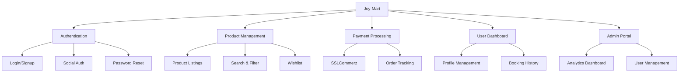
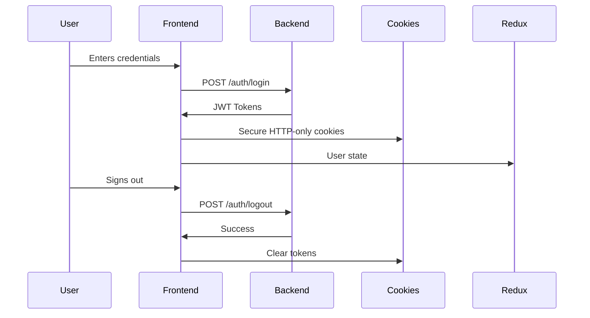

# 🛍️ Joy-Mart - Ultimate E-Commerce Platform


## 🌟 Next-Gen Shopping Experience



## 🚀 Key Features

### 🛒 Core Shopping Features
- **Product Catalog** with advanced search & filtering
- **Wishlist** (LocalStorage persistence)
- **Booking System** with database storage
- **SSLCommerz Payment Gateway** integration
- **Order Tracking** with real-time updates

### 👤 User Features
- **Profile Management** (Update personal data, avatar)
- **Password Reset** flow
- **Notification Preferences**
- **Role-based Dashboard** (User/Admin views)
- **Secure Authentication** with JWT tokens

### 🛠️ Admin Superpowers
- **Complete Product CRUD** operations
- **User Management** with role assignment
- **Analytics Dashboard** with Chart.js visualizations
- **Push Notifications** via Firebase
- **System Settings** configuration

## 🎨 UI Components Showcase

```jsx
// Interactive Product Filter Component
const ProductFilters = () => (
  <div className="bg-white p-4 rounded-lg shadow">
    <h3 className="font-bold text-lg mb-4">Filters</h3>
    <div className="space-y-4">
      <PriceRangeSlider />
      <CategoryAccordion categories={categories} />
      <RatingFilter />
      <button className="w-full bg-primary text-white py-2 rounded hover:bg-primary-dark transition">
        Apply Filters
      </button>
    </div>
  </div>
);
```

## 🔐 Secure Authentication Flow



## 📱 Responsive Design

| Breakpoint | Layout |
|------------|--------|
| < 640px | Mobile-optimized single column |
| 640-768px | Tablet-friendly layout |
| 768-1024px | Compact desktop view |
| > 1024px | Full desktop experience |

## 🛠️ Technical Implementation

### State Management Architecture
```javascript
// Redux store configuration
const persistConfig = {
  key: 'root',
  storage,
  whitelist: ['auth', 'wishlist']
};

const rootReducer = combineReducers({
  auth: authReducer,
  products: productReducer,
  cart: cartReducer,
  wishlist: wishlistReducer
});

const persistedReducer = persistReducer(persistConfig, rootReducer);
```

### Push Notification Service
```javascript
// Firebase push notification handler
export const initializeFirebase = () => {
  const firebaseConfig = {
    apiKey: process.env.NEXT_PUBLIC_FIREBASE_KEY,
    // ... other config
  };
  
  if (!getApps().length) {
    initializeApp(firebaseConfig);
    const messaging = getMessaging();
    onMessage(messaging, (payload) => {
      toast.info(payload.notification.title);
    });
  }
};
```

## 🏆 Performance Optimizations

- **Image Lazy Loading** for product listings
- **Code Splitting** with dynamic imports
- **Server-side Rendering** for critical pages
- **Redux Persist** for client-side state
- **Turbopack** for faster development builds

## 📊 Admin Dashboard Preview

| Section | Features |
|---------|----------|
| **Overview** | Sales metrics, recent activity |
| **Analytics** | Interactive product charts |
| **Products** | CRUD operations, bulk actions |
| **Users** | Role management, status control |
| **Notifications** | Firebase push notification sender |

## 🧑‍💻 Developer Experience

```bash
# Recommended VS Code Extensions
code --install-extension esbenp.prettier-vscode
code --install-extension dbaeumer.vscode-eslint
code --install-extension bradlc.vscode-tailwindcss
```

## 🌈 Color Palette System

```javascript
// tailwind.config.js
module.exports = {
  theme: {
    extend: {
      colors: {
        primary: {
          100: '#e0e7ff',
          500: '#4f46e5',
          900: '#312e81'
        },
        danger: '#ef4444',
        success: '#10b981',
        warning: '#f59e0b'
      }
    }
  }
}
```

## 📬 Contact & Support

Have questions or need help? Reach out to our team:

- **Email**: support@joymart.com
- **Live Chat**: Available in-app
- **Contact Form**: `/contact` page
- **Community Forum**: [forum.joymart.com](https://forum.joymart.com)

---

🚀 **Ready to revolutionize e-commerce?** Star our repo and join the Joy-Mart journey!